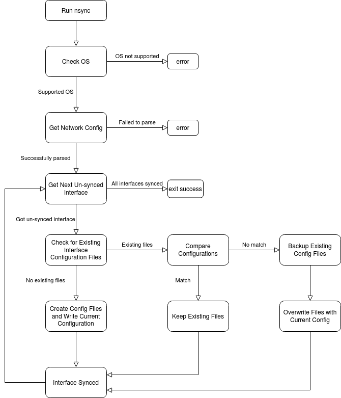

# nsync

The Network Configuration Sync (nsync) utiltiy is a C-based Linux utility used to scrape active network configurations and apply them persistently.

## Project Goals:
1) Sync the existing network configuration – to allow for restoration of the active network config on network/system reboot.
2) Backup any existing configurations – the utility will not overwrite any configuration files that conflict, but will instead back them up to a date-stamped directory in either their existing location or a user specified path/location
3) Support multiple Linux distributions and versions.

## Description
Common Linux commands such as ifconfig, ip, and route are used to modify network configurations; however, these changes are not persistent. In the cases where the system or network is restarted, the system relies on pre-existing persistent configuration files to rebuild the state of the system’s network. The pre-reboot configuration is unrecoverable without it being saved in these persistent files, so resetting the network configuration back to its previous state must be done manually in some cases. This manual configuring can be an error-prone process and may result in major networking issues that are difficult to track down. Additionally, many Linux distributions and versions have slightly different ways of preserving and editing the configuration, which can cause additional human error.

Nsync aims to simplify and streamline this process by allowing for users to “sync” their active network configuration. In other words, they will be able to save their existing configuration into persistent files, so that in the the event of a system or network reboot, their network configuration will restore to its previous state.

## Supported OS

| OS              | Set Config                               | Get Config                                          | Restart Network                                     | Files                                                                                                        |
|-----------------|------------------------------------------|-----------------------------------------------------|-----------------------------------------------------|--------------------------------------------------------------------------------------------------------------|
| CentOS 6        | ip route<br>ip addr<br>ifconfig<br>route | ip route<br>ip link<br>ip addr<br>ifconfig<br>route | <br>service network restart                     | /etc/sysconfig/network-scripts/ifcfg-\<interface\><br>/etc/sysconfig/network-scripts/route-\<interface\> |
| CentOS 7        | ip route<br>ip addr<br>ifconfig<br>route | ip route<br>ip link<br>ip addr<br>ifconfig<br>route | <br>systemctl restart network                   | /etc/sysconfig/network-scripts/ifcfg-\<interface\><br>/etc/sysconfig/network-scripts/route-\<interface\> |
| CentOS 8        | ip route<br>ip addr<br>ifconfig<br>route | ip route<br>ip link<br>ip addr<br>ifconfig<br>route | <br>nmcli networking off && nmcli networking on | /etc/sysconfig/network-scripts/ifcfg-\<interface\><br>/etc/sysconfig/network-scripts/route-\<interface\> |
| <= Ubuntu 16.04 | ip route<br>ip addr<br>ifconfig<br>route | ip route<br>ip link<br>ip addr<br>ifconfig<br>route | <br>/etc/init.d/networking restart              | <br>/etc/network/interfaces                                                                              |

## Installation

Clone this repo and compile the executable: 
```bash
git clone https://github.com/hyannisportresearch/nsync.git
make nsync

# If you want to be able to run the executable from anywhere, move it to the /bin folder
mv nsync /bin/

# After compilation the source files can be deleted.
rm nsync*.c nsync*.o nsync*.h
```


## Usage

```
Usage: nsync [-h] [-a] [-v] [-b </path/to/backup/>]
        -h -- prints this usage
	-a -- toggles the arping wait option off in config files (NOTE: not useful for all OS/Distros)
	-v -- runs nsync in verbose mode
	-b -- sets backup location to the <path/to/backup> that follows
```

Example usage:
```bash
nsync -v

nsync -b /etc/backups/

nsync -a -b ~/user/location -v
```
## Visual Flow of Utility



## How Backups Work
A check will then be done to determine if there are any persistent configurations. If there are none for a given interface, then a new configuration file will be created and populated with the correct configuration commands to setup that interface (dependent on OS). In the event a file already exists, the utility will determine if the active configuration for that interface is a match with its petrsistent configuration file by comparing parsed fields. If they are identical, no changes will be made to that configuration file and the duplicate will be deleted. In the case where the existing file(s) do not match the active configuration for an interface, a date-stamped backup directory will be made to store the existing file(s) prior to overwriting them with the new configuration. 

The backups of the configuration files will be saved by default to the current directory of the configuration files in a date-stamped directory. For example, in the case of CentOS 6, 7, and 8, this location would be `/etc/sysconfig/network-scripts/nsync.<datestamp>`. In the event that multiple syncs are run in one day, a directory will be created using the same datestamp but with a version number appended to the end. The user may also specify a location to save the backups using the [-b] flag followed by the absolute path to a directory. If there is an error accessing the provided path, then the utility will default to the current config directory and an error will be printed.

## CHANGELOG
See: [CHANGELOG](CHANGELOG.md)

## Contributing
We are looking for the following types of contributions:

1) Bug Fixes!

2) OS support -- We'd love to have this utility support a wide range of distros, versions, and even OS's!

3) Interface support -- this utility was built primarily for use with ethernet interfaces. It would be great to explicitly support other types of interfaces as well!

4) Any feedback and thoughts!

Please see the [CONTRIBUTING](CONTRIBUTING.md) documentation for more details on how to contribute! 

## Authors and Acknowledgement
Created by Hyannis Port Research, Inc.

## License
[LICENSE](LICENSE.txt)
